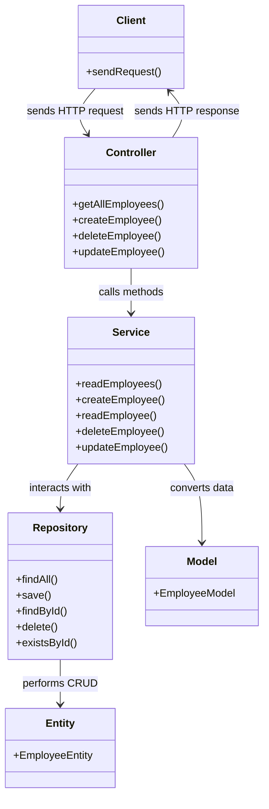

# Spring Boot Application
### Spring Boot Application Request Flow

Below is a detailed explanation of how a request travels through different layers (folders/packages) in a typical Spring Boot application, along with a diagram to illustrate the flow.

#### Folder Structure and Request Flow

1. **Controller Layer (`controller` package)**:
   - **Role**: Handles incoming HTTP requests and sends responses.
   - **Flow**: The client sends an HTTP request to a specific endpoint. The request is received by a controller class, which is annotated with `@RestController` or `@Controller`.
   - **Example**: `EmpController` class handles requests related to employees.

2. **Service Layer (`service` package)**:
   - **Role**: Contains business logic and processes data received from the controller before interacting with the repository.
   - **Flow**: The controller calls methods from the service class, which is annotated with `@Service`.
   - **Example**: `EmployeeServiceImpl` class implements the business logic for employee operations.

3. **Repository Layer (`repository` package)**:
   - **Role**: Interacts with the database to perform CRUD operations.
   - **Flow**: The service layer calls methods from the repository interface, which is annotated with `@Repository` and extends `JpaRepository` or another Spring Data repository interface.
   - **Example**: `EmployeeRepository` interface handles database operations for the `EmployeeEntity`.

4. **Entity Layer (`entity` package)**:
   - **Role**: Represents the database entities (tables).
   - **Flow**: The repository layer uses these entity classes to interact with the database.
   - **Example**: `EmployeeEntity` class represents the `employee` table in the database.

5. **Model Layer (`model` package)**:
   - **Role**: Contains data transfer objects (DTOs) used to transfer data between the layers.
   - **Flow**: The controller and service layers use these model classes to transfer data.
   - **Example**: `EmployeeModel` class is used to transfer employee data between the controller and service layers.

#### Example Flow

1. **Client** sends an HTTP request to the endpoint `/employees`.
2. **Controller** (`EmpController`):
   - Receives the request at the `@GetMapping("employees")` method.
   - Calls the `readEmployees` method of the `EmployeeService`.

3. **Service** (`EmployeeServiceImpl`):
   - The `readEmployees` method fetches all employees by calling the `findAll` method of the `EmployeeRepository`.

4. **Repository** (`EmployeeRepository`):
   - The `findAll` method interacts with the database to retrieve all employee records.
   - Returns the list of `EmployeeEntity` objects to the service layer.

5. **Service** (`EmployeeServiceImpl`):
   - Converts the list of `EmployeeEntity` objects to a list of `EmployeeModel` objects.
   - Returns the list of `EmployeeModel` objects to the controller.

6. **Controller** (`EmpController`):
   - Sends the list of `EmployeeModel` objects as an HTTP response to the client.

#### Diagram

### Annotations Used in a Spring Boot CRUD Application

#### 1. **Spring Boot Application Setup**
- `@SpringBootApplication`: Indicates a configuration class that declares one or more `@Bean` methods and also triggers auto-configuration and component scanning.

#### 2. **Controller Layer**
- `@RestController`: Combines `@Controller` and `@ResponseBody`, indicating that the class handles HTTP requests and returns JSON/XML responses.
- `@RequestMapping`: Maps HTTP requests to handler methods of MVC and REST controllers.
- `@GetMapping`, `@PostMapping`, `@PutMapping`, `@DeleteMapping`: Specialized versions of `@RequestMapping` for specific HTTP methods.
- `@PathVariable`: Indicates that a method parameter should be bound to a URI template variable.
- `@RequestBody`: Indicates that a method parameter should be bound to the body of the web request.

#### 3. **Service Layer**
- `@Service`: Indicates that a class is a service, originally defined by Domain-Driven Design (DDD) as an operation offered as an interface that stands alone in the model, with no encapsulated state.

#### 4. **Repository Layer**
- `@Repository`: Indicates that the class provides the mechanism for storage, retrieval, search, update, and delete operation on objects.
- `@Query`: Used to define SQL queries directly on repository methods.

#### 5. **Entity Layer**
- `@Entity`: Specifies that the class is an entity and is mapped to a database table.
- `@Table`: Specifies the table in the database with which the entity is mapped.
- `@Id`: Specifies the primary key of an entity.
- `@GeneratedValue`: Provides for the specification of generation strategies for the values of primary keys.
- `@Column`: Used to specify the mapped column for a persistent property or field.
- `@ManyToOne`, `@OneToMany`, `@OneToOne`, `@ManyToMany`: Define relationships between entities.

#### 6. **Validation**
- `@Valid`: Marks a method parameter or return value for validation.
- `@NotNull`, `@NotEmpty`, `@NotBlank`, `@Size`, `@Min`, `@Max`, etc.: Used for bean validation constraints.

#### 7. **Transactional Management**
- `@Transactional`: Demarcates transactions at the method or class level.

#### 8. **Logging**
- `@Slf4j`: Lombok annotation to create a logger field.